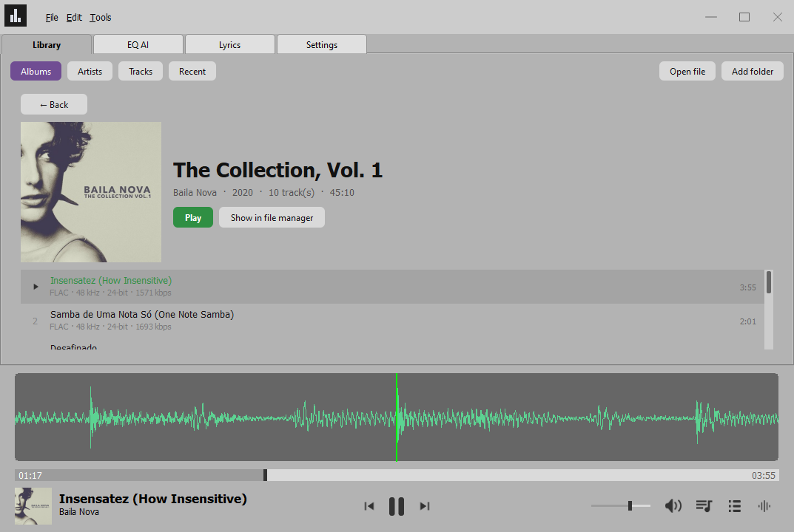
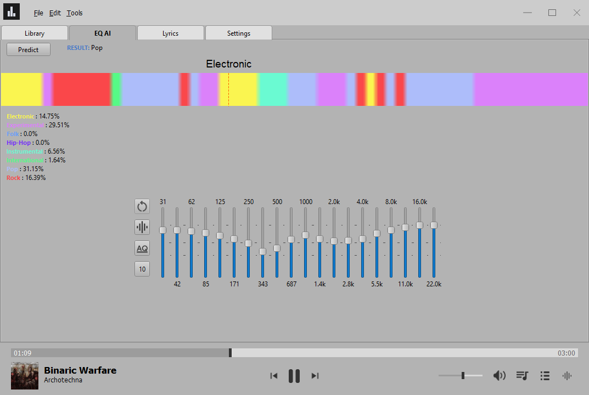
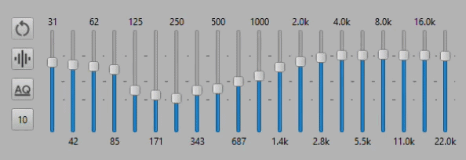
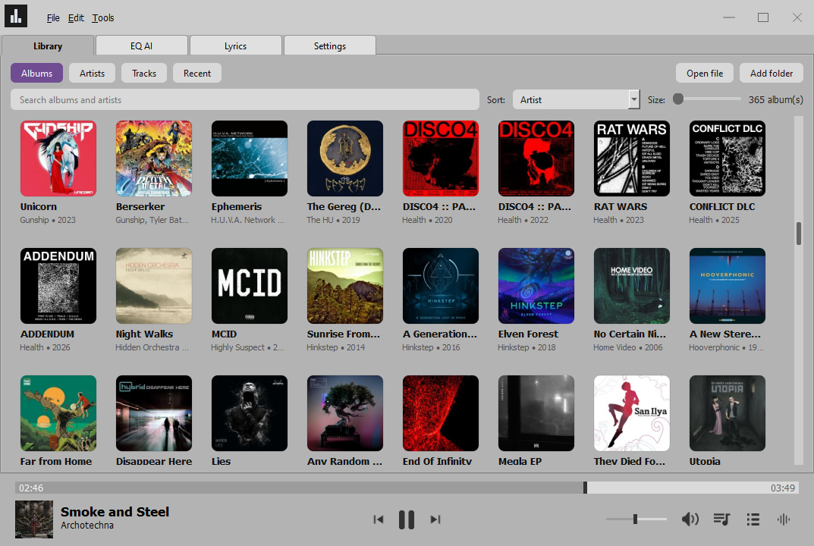

<div align="center">

#  AudioNetLab

**A desktop music player for Windows with a neural genre classifier in the playback path: the track is divided in 3-second fragments, that are subsequently classified, and a 20-band equalizer follows fragments during playback according to assigned genre.**

[](#requirements)
[](#requirements)
[](#requirements)
[](#how-it-works)
[](LICENSE)

</div>

<p align="center">
  
  <br />
  <sub><i>The main application window displaying an album card with its tracklist, and a media player at the bottom featuring an audio waveform</i></sub>
</p>

---

## Overview

AudioNetLab is a music player for Windows built around a genre classifier that runs on the track
being played. The track is split into 3-second fragments. Each fragment is reduced to a 57-value
feature vector — chroma, RMS, spectral centroid, bandwidth and rolloff, zero-crossing rate,
harmonic and percussive statistics, tempo, and the mean and variance of 20 MFCC coefficients —
standardised with the scaler from the training pipeline and classified into one of eight FMA
genres. A fragment whose top probability is below 0.85 keeps the label of the previous fragment,
which suppresses single-fragment flicker at transitions.

The output is a genre label per fragment across the whole track, drawn as a timeline. The player
uses it to drive the equalizer: in Auto EQ mode the 20 band gains follow the genre under the
playback cursor and interpolate towards the preset saved for that genre instead of switching in one
step. Equalisation is applied to every playback chunk as a gain mask over the STFT, so a change in
the gains takes effect within one chunk without interrupting the stream.

The rest is a conventional player: a SQLite library with a folder scanner and an album grid, a play
queue, a waveform view, tag and lyrics panels, and an English/Russian interface.

Inference is local. The model is part of the repository and runs through ONNX Runtime on the CPU; 
in the default configuration the application makes no network requests.

## Features

* **Playback.** MP3, FLAC and WAV, decoded into memory and streamed to the output device from a
  background thread. The output device and the PortAudio buffer size (512 to 16384 frames) can be
  changed while a track is playing.
* **Genre classification.** A label per 3-second fragment over the whole track, shown as a coloured
  timeline together with the share of each genre and the most frequent one as the result. The
  feature vectors are cached per track, so a repeated prediction only re-runs inference.
* **20-band equalizer.** Applied in the frequency domain to every playback chunk, so a change in the
  gains takes effect without restarting the stream. Gains are stored as a preset per genre.
* **Auto EQ.** The band gains follow the genre under the playback cursor, moving towards that
  genre's preset by a fraction of the remaining distance per update; the divisor is adjustable
  from 2 to 20.
* **Library.** SQLite database, folder scanner on a separate thread, an album grid and a flat track
  list with search and sort, and a play queue. Covers are cached pre-scaled and shared between
  albums with the same artwork. A track or a whole album can be removed from any list, which also
  clears the cached data it leaves behind.
* **Interface.** Waveform panel rendered with OpenGL, tag panel, lyrics tab with a timeline that
  follows playback, English and Russian localisation.
* **Experimental modules,** off by default: audio transcription, lyrics translation and
  summarization, and a chat tab. They require an external HTTP service, see
  [Experimental modules](#experimental-modules).

<p align="center">
  
  <br />
  <sub><i>The EQ AI tab — genre timeline over the track, genre shares, and the live 20-band EQ. </i></sub>
</p>

## How it works

Playback and classification are two separate paths that meet at the equalizer.

**1. Playback is a streaming pipeline.** The track is decoded into
memory and pushed to the output device chunk by chunk on a background thread. Every chunk passes
through the STFT equalizer on its way out.

```txt
decode → buffer → streaming thread → per-chunk STFT equalizer → output device
```

**2. Genre drives the EQ.** The classifier labels each 3-second fragment. In Auto EQ mode the player
looks up the genre under the playback cursor, takes that genre's saved preset and moves each band
towards it by a fraction of the remaining distance on every position update, so where two genres
meet the EQ curve crosses over across several updates instead of in one.

<p align="center">
  
  <br />
  <sub><i>Auto EQ interpolation</i></sub>
</p>

The first prediction of a track is the slow one, because the librosa features have to be extracted.
They're cached in the track registry, so predicting the same track again only re-runs the model.

## Requirements

* **Windows 10 or newer.** The app uses Windows-only APIs (DPI detection, Explorer integration) and
  will not run on Linux or macOS as-is on current release.
* **Python 3.10** (developed and tested on 3.10.7).
* A working audio output device.

## Installation

```bat
git clone <repository-url>
cd AudioNetLab

python -m venv venv
venv\Scripts\activate

pip install -r requirements.txt
```

The genre model is included under `models/` — nothing needs to be downloaded separately.

## Running

With the virtual environment activated:

```bat
python main.py
```

…or directly, without activating it:

```bat
venv\Scripts\python.exe main.py
```

On first start the app creates `data/local/`, `data/registry/` and a `storage.db` database in the
project folder, so **run it from the project root**.

## First steps

1. On the **Library** tab press **Open file** or **Add folder**, or drag audio files and folders
   onto the window — they're added to the library.
2. Switch to **Tracks** and click a track to play it, or double-click an album cover on **Albums**.
   The player panel is pinned to the bottom: transport, position slider, volume, waveform toggle and
   tag-panel toggle.
3. Open the **EQ AI** tab and press **Predict**. The track is analysed and a coloured genre timeline
   appears, along with the genre shares and the final genre.
4. Use the buttons to the left of the equalizer to control it:
   -  to reset the sliders;
   -  to enable or disable the equalizer;
   -  for sliders to follow the detected genre;
   -  to set the interpolation smoothness (scroll mouse wheel while cursor is over the button).

<p align="center">
  
  <br />
  <sub><i>The Library tab, Albums view.</i></sub>
</p>

## Configuration

### config_app.ini

Written automatically on exit next to `main.py`. Editing it by hand is optional.

| Section | Key | Meaning |
| --- | --- | --- |
| SystemSettings | form_width, form_height | Window size |
| SystemSettings | form_position | Window position as `x:y` |
| SystemSettings | version | Version that wrote the file |
| SystemSettings | language | Interface language code; empty follows the system locale |
| SystemSettings | last_folder | Folder the open-file dialog starts in |
| SystemSettings | open_filename | Last opened track |
| PlayerSettings | volume | Volume slider value, 0..1000 |
| PlayerSettings | auto_play | Reserved |
| PlayerSettings | graph_visible | Waveform panel visibility |

### src/global_constants.py

Developer-level switches that are not exposed in the UI:

| Constant | Meaning |
| --- | --- |
| `DEBUG` | Debug logging; the AI tabs stay enabled without an opened track |
| `PROFILE` | Collect timings for the profiler window (Tools → Profiling) |
| `AI_ENABLED` | Load the genre model at startup; turn off for a faster start |
| `EXPERIMENTAL_MODULES` | Modules that call an external HTTP service; off by default |
| `CUSTOM_TITLE_BAR` | Frameless window with the custom title bar |
| `LOG_IN_FILE` | Duplicate console output into `logs/` |
| `GENRE_MODEL_PATH` | Path to the ONNX classifier |
| `ONNX_SESS_PROVIDER` | `CPUExecutionProvider` or `DmlExecutionProvider` for a GPU |
| `PATTERN_SIZE` | Length of one classified fragment in seconds; must match the model |
| `SAMPLING_RATE_AI` | Sampling rate the model was trained on |
| `EQ_SLIDER_COUNT` | Number of equalizer bands |
| `GENRE_DICT` | Model output index → genre name |

`PATTERN_SIZE`, `SAMPLING_RATE_AI` and `GENRE_DICT` describe the bundled model. Changing them
without changing the model will produce wrong results.

### Audio settings

The **Settings** tab, audio settings:

* **Device** — output device; press **Switch** to apply. Playback keeps running.
* **Buffer size** — the device (PortAudio) buffer, 512 to 16384 frames. This is the
  stutter-resistance knob: a larger buffer tolerates longer CPU stalls without a dropout, at the
  cost of latency. The equalizer's processing block is separate and stays small, so the EQ keeps
  reacting quickly whatever this is set to.
* **Logarithmic volume control** — makes the volume slider feel linear to the ear.

### Equalizer presets

To set a preset pick a genre, move the sliders, press **Save
preset**. They are stored in `res/presets.pickle` and picked up by Auto EQ right after saving.

### Interface language

English and Russian are available; the choice is applied
immediately and stored in `config_app.ini`. On the first start the language follows the system locale
and falls back to English when the locale has no catalog.

The **Interface** page also chooses whether an album or artist tile opens on a single or a double
click.

### Library

**Clean up now** removes the cached covers and per-track folders left on disk by albums that are no
longer in the library, and reports how much it freed. See [Data on disk](#data-on-disk).

## Data on disk

| Path | Content |
| --- | --- |
| `storage.db` | SQLite library: tracks, artists, albums, covers, scanned folders |
| `data/registry/<track_id>/` | Per-track cache: tags, feature vectors, lyrics |
| `data/covers/` | Pre-scaled covers, named after the hash of the source image |
| `res/presets.pickle` | EQ presets per genre |
| `res/i18n/` | Translation catalogs, `.ts` sources and compiled `.qm` |
| `res/icons/` | Interface icons |
| `models/` | ONNX and h5 genre models |
| `config_app.ini` | Application settings |
| `error_log.txt` | Uncaught exceptions |

Deleting a track also deletes its registry folder if it has one, and the cached cover once no
other track or album uses that image. Removing a whole album takes its tracks with it, and its
artist when nothing else credits them. The audio files are never touched — the app only stores
their paths, so a deleted track comes back by adding its file again.

**Settings → Library → Clean up now** sweeps what slipped past that: covers and registry folders
left behind by an older version or by a delete that could not remove a file, and cached copies in a
size the app no longer uses. It runs on its own thread and reports how much it freed. It never
touches anything the library still references, so it is safe to run at any time — but not while a
scan is running, and it declines to start in that case.

<details>
<summary><b>Library internals</b> — importing, the Library tab, the database schema</summary>

### Importing into the library

Drop any number of files and whole folders on the window, use **File → Open file** for a multiple
selection, or **File → Add folder to the library** for a folder. A single dropped file is registered
immediately; anything larger goes to the scanner, which runs on its own thread and reports on a
strip above the player with a cancel button. The window stays usable while it works, and a cancelled
scan keeps everything it had already imported.

Two things keep the cost of a large import down:

* A file whose modification time did not change is never opened again, so a rescan of an unchanged
  collection costs a directory walk. On a collection of 3663 tracks that is 0.1 s.
* FLAC tags are read by a small parser that seeks past the artwork instead of loading it, because
  mutagen reads every metadata block and a FLAC with a cover carries a few hundred kilobytes of it.
  This reads 0.6 KB per track instead of 306 KB. The cover itself is decoded once per album, not
  once per track, and cached under `data/covers/` named after the hash of the image, so albums
  sharing artwork share one file.

A file that is no longer on disk is flagged rather than deleted, so an unplugged drive does not take
the library and its play counts with it. Such tracks are listed as missing, and the flag is cleared
by the next scan that finds the file unchanged in its place.

### The Library tab

The **Library** tab holds everything that was imported. It has two views, switched at the top left:
**Albums**, a grid of covers, and **Tracks**, the flat list of every track. The open-file and
add-folder buttons sit in the same top bar.

The album view is sorted by artist, title, year or add date, with a search box over the album and
artist names and a slider for the tile size. Double-clicking a cover opens the album page: its
cover, title and totals with a play button and a reveal-in-file-manager button, and below that the
track list with each track's own number, format (codec, sample rate, bit depth, bitrate) and length.
Playing an album puts the whole album into the queue, so it plays through and the next and previous
buttons step through it; the track that is playing is marked in the list and the mark follows an
autoplay to the next one. The track view lists every track newest first and plays one on click.

The grid is a `QListView` with a `QStyledItemDelegate`, not a widget per album, so it paints only the
tiles on screen and the work per repaint does not grow with the size of the library. Covers are
loaded outside the interface thread: a tile shows whatever is already in memory and a placeholder
otherwise, and the finished image repaints just that tile when it arrives.

Every track list — the album page, the artist page, the flat track view and the recent list — can
delete. A delete button appears at the right end of the row under the cursor, the right button opens
a menu with play, queue, reveal and remove, and the Delete key removes the selected track. There is
no confirmation for a single track: the file stays on disk and adding it back is a drag and drop
away. Removing a whole album is the destructive one, so the red button on the album page and the
Remove album entry on a tile ask first, naming the album and how many tracks go with it.

Deleting the last track of an album removes the album and, if it also empties out, the artist, so
the grid keeps no tile for an album without tracks. A database from before this rule is cleaned once
by the schema migration.

The track playing when its own row is deleted plays on to its end: the audio is already decoded and
the file is untouched. It keeps its place in the queue as well, so the autoplay at the end still
moves to the track that follows it.

Playing an album, or a track from any list, fills a play queue: the player advances through it at
the end of each track, and the previous and next buttons step through it. The queue button opens a
side panel that shows the current track and what comes next, where a click jumps to a track and an
upcoming track can be removed. A single playback controller owns the queue and the current track, so
the album page, the track list and the queue panel all show the same playing state.

### Database schema

`storage.db` carries its schema version in `PRAGMA user_version`, and `src/api/db/migrations.py`
upgrades it on the first connection of a run. There is no Alembic: each version is one function in
`MIGRATION_STEPS`, run in its own transaction, so a failed upgrade leaves the file on the previous
version. To change the schema, edit the models, append a step and bump `CURRENT_SCHEMA_VERSION`.

Artists and albums are deduplicated on a key column that is casefolded in Python rather than by
`COLLATE NOCASE`, because SQLite only folds ASCII and would file "Ария" and "ария" as two artists.
The same keys are what the library search matches against. Tracks are grouped into an album by album
artist and title, taking the `ALBUMARTIST` tag when the file has one, otherwise a compilation would
break up into one album per track.

</details>

## Project structure

```
main.py                     Entry point: logging, DPI, main window
src/
  forms/                    MainForm, the main window and the module wiring
  core/
    library/                Folder scanner, cover cache, deletion and cleanup, the Library tab
    i18n/                   Translation manager, loads and switches the catalogs
    audio/                  AudioStreamer (streaming thread), AudioPlayer (player panel)
    render/graphics_system/ OpenGL waveform panels
    qt_widgets/             Shared widgets: sliders, equalizer, title bar, overlays
    file_system/            Tag reader, track registry and the recent-track list
    settings/               Settings object and the settings pages
    workers/                Background workers: file opening, genre prediction, scan, cleanup
    log_system/             Logging and the profiler
    point_system/           Point helper type
  ai_module/
    genre_classification/   The EQ AI tab: prediction, timeline, auto EQ
    transcription/          Experimental lyrics modules
  api/db/                   SQLAlchemy models, schema migrations, library queries
  function_lib/             Audio features, the equalizer, ONNX loading, math helpers
  enums/                    Enumerations
  global_constants.py       Switches and paths
installer/                  PyInstaller build script
tools/                      Development scripts, translation catalog rebuild
docs/images/                Screenshots and diagrams for this README
models/                     Genre models
res/                        Icons, EQ presets, translation catalogs
```

## Experimental modules

Everything that talks to an external HTTP service sits behind `EXPERIMENTAL_MODULES` in
`src/global_constants.py` and is **off by default**, so a copy of the app runs fully offline and
needs nothing beyond `requirements.txt`.

**Off (the default):**

* No Chat tab.
* The Lyrics tab still works: lyrics are read from the file tags, the timeline follows playback,
  clicking a line seeks the track, and the timestamp toggle and extraction button stay in place.
* The right side panel of the Lyrics tab shows only the "Common" page, without the transcription,
  translation and summarization sections.
* The `requests` package is never imported, so it doesn't have to be installed.

**On:**

```python
EXPERIMENTAL_MODULES = True
```

Then install the development requirements (they add `requests`):

```bat
pip install -r requirements-dev.txt
```

These modules expect an HTTP service on `http://127.0.0.1:13000` with the endpoints
`audio/transcription/process`, `text/translate/process` and `text/summary/process`. The service is
not part of this repository; without it the buttons will fail on a connection error.

## Working with translations

Translations use the Qt Linguist toolchain. Literals in the code are English and are wrapped in
`self.tr(...)`, or in `QCoreApplication.translate("Context", ...)` in classes that are not widgets.
Every other language lives in a catalog under `res/i18n/`.

The tooling is a development dependency:

```bat
pip install -r requirements-dev.txt
```

After adding or changing a `tr()` string, rebuild the catalogs:

```bat
venv\Scripts\python.exe tools/update_translations.py
```

The script scans the sources with `pylupdate6`, refreshes `res/i18n/audionetlab_ru.ts` keeping the
existing translations, and compiles the `.qm` the app loads. New strings appear as unfinished —
translate them in the Qt Linguist editor and run the script again:

```bat
venv\Scripts\pyside6-linguist.exe res/i18n/audionetlab_ru.ts
```

To add a language, put its code into `LANGUAGES` in `tools/update_translations.py` and into
`LANGUAGE_NAMES` in `src/global_constants.py`, then run the script. The new language shows up in the
settings automatically.

Two rules matter when writing new UI code:

* A widget applies its texts in a `retranslate_ui()` method and calls it both from `__init__` and
  from `changeEvent` on `QEvent.Type.LanguageChange`. Without that its texts won't follow a language
  switch.
* Standard dialog buttons come from the Qt catalog bundled with PyQt6 and need no work.

## Building a standalone executable

```bat
venv\Scripts\activate
python installer/PyInstaller_running.py
```

The script fills `main_template.spec` with the current name, version and model path, writes
`main_generate.spec` and runs PyInstaller. The result appears in `dist/AudioNetLab v<version>/`. It
reads the active virtual environment from `VIRTUAL_ENV`, so the environment must be activated.

## License

Released under the [Apache License 2.0](LICENSE).
